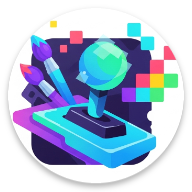

# 🚀 Dreamcraft 🎨

  

**Unleash your creativity and bring your game ideas to life, powered by AI!**

Dreamcraft is an innovative Android application that allows you to generate and interact with game worlds and interactive experiences. Describe your vision, and let our AI assist you in crafting unique digital adventures. Whether you're a seasoned developer or just starting, Dreamcraft offers a fun and intuitive platform to explore the power of generative AI in game creation.

## ✨ Features

*   **AI-Powered Generation:** Leverage cutting-edge AI models (Groq, OpenAI, Gemini, Claude, and local models) to generate game content, scripts, and even code snippets.
*   **Interactive Game Environment:** Play and test your creations directly within the app.
*   **Project Management:** Easily manage your game projects, files, and configurations.
*   **Multi-Platform Support:** Design for various project types, including Love2D games and HTML-based experiences.
*   **Flexible AI Configuration:** Switch between different cloud and local AI models to suit your needs.
*   **Code Editor Integration:** Seamlessly edit your project files with an in-app editor.
*   **Intuitive UI:** A clean and user-friendly interface built with Jetpack Compose.

## 🛠️ Tech Stack (Tentative - based on project structure)

*   **Frontend:** Kotlin, Jetpack Compose
*   **AI Integration:** Connections to various LLM APIs (Groq, OpenAI, Gemini, Claude) and local model support.
*   **Core Logic:** Kotlin
*   **Build System:** Gradle

## 📸 Screenshots & Video

*(Coming Soon! I'll be adding a captivating video and some stunning screenshots to showcase Dreamcraft in action.)*

## 🚀 Getting Started

*(Details on how to build the project from source or install an APK will be added here if applicable.)*

## 🤝 Contributing

Contributions are welcome! If you have ideas for new features, bug fixes, or improvements, please feel free to:

1.  Fork the Project
2.  Create your Feature Branch (`git checkout -b feature/AmazingFeature`)
3.  Commit your Changes (`git commit -m 'Add some AmazingFeature''''`)
4.  Push to the Branch (`git push origin feature/AmazingFeature`)
5.  Open a Pull Request

## 📄 License

Distributed under the [Your License Type Here - e.g., MIT License]. See `LICENSE.txt` for more information. *(You'll need to add a LICENSE.txt file if you don't have one)*

## 📧 Contact

Your Name/Project Link - your@email.com or [Project Link](https://github.com/yourusername/Dreamcraft)

Acknowledgements:
*   [Any libraries or resources you want to thank]

---

  Made with ❤️ and lots of ☕

